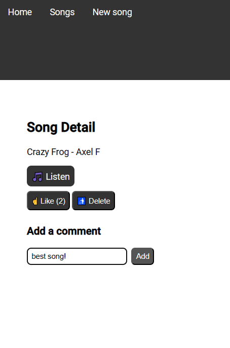
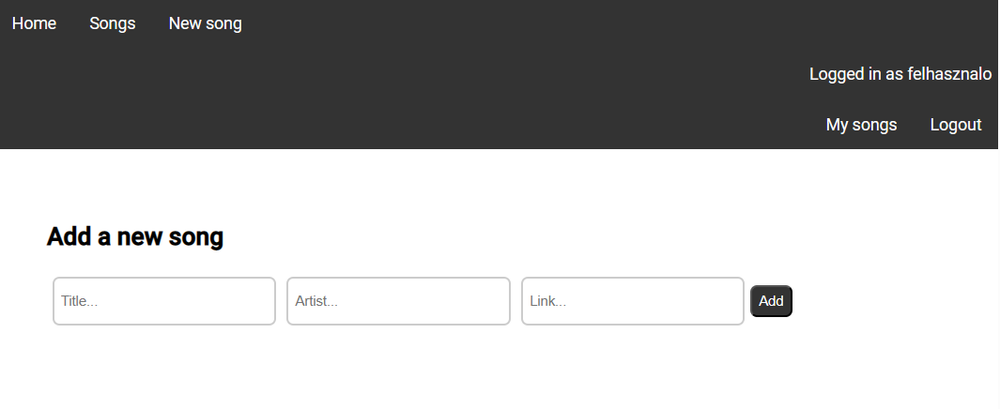
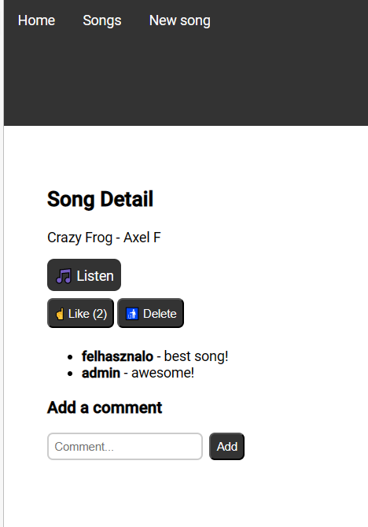
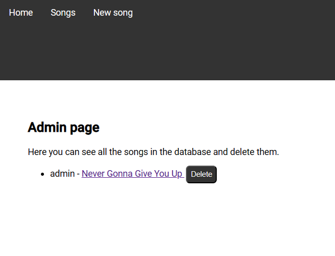

# PRF Beadandó projekt

> Matolcsy Mátyás (KNDQJI)

Az alkalmazás a következő címen érhető el: https://prf-production.up.railway.app/home

Előre feltöltött felhasználók:
| felhasználónév | jelszó |
| -------------- | ------ |
| admin | matyi |
| felhasznalo | jelszo |
| masikFelhasznalo|masikJelszo |

## Lokális futtatás

Lokális futtatáshoz a következő parancsokat kell kiadni:

```bash
cd client
npm install
npm run build
```

A kliens a `server/public` mappájába fog build-elődni.

```bash
cd server
npm install
npm run build
npm run start
```

Vagy Dockerrel:

```bash
docker build -t kndqjiprf .
docker run -p 3001:3001 kndqjiprf
```

### Környezeti változók - példa

```bash
MONGO_URL=mongodb://127.0.0.1:27017/kndqji-beadando
PORT=3001
```

Ezek az alapértelmezett értékek, így nem szükséges megadni őket.

## Feladat

A feladat egy Full-Stack webalkalmazás elkészítése.

Használt technológiák:

- Backend: TypeScript, Node.js, Express.js, MongoDB (Mongoose)
- Frontend: TypeScript, Angular.js

## Megvalósítás

A webalkalmazás egy egyszerű zenei blog, ahol a felhasználók megoszthatják egymással a kedvenc zenéiket, illetve hozzászólhatnak mások zenéihez.

Egy felhasználó csak akkor tud hozzászólni egy zenéhez, ha be van jelentkezve. A bejelentkezéshez regisztráció szükséges.

Zenékhez meg lehet adni egy címet, egy előadót, illetve egy linket, amelyen a zene elérhető.

A felhasználók a zenékhez hozzászólásokat fűzhetnek, amelyekhez meg kell adniuk egy üzenetet.

A felhasználók a saját zenéiket törölhetik.

### Képernyőképek



Egy zeneszám adatlapja.

---



Egy új zeneszám hozzáadása.

---



Egy zeneszámhoz tartozó hozzászólások.

---



Az admin felület, ahol a felhasználók zenéit lehet törölni.
Ezt a felületet csak az adminisztrátorok érhetik el. Az adminisztrátorokat **csak** a backend seed-elés során lehet létrehozni.

## Követelmények

### Backend (45 pont)

| Követelmény                                                                                                  | Megvalósítás                                                                                         | Pont |
| ------------------------------------------------------------------------------------------------------------ | ---------------------------------------------------------------------------------------------------- | ---- |
| A backend statikusan hostolja a frontendet                                                                   | A frontend `build` parancsa a backend `public` mappájába ment, statikusan hosztolja azt.             | 5    |
| Az alkalmazás kapcsolódik egy mongodb instance-hoz                                                           | localhost-on csatlakozik `(mongodb://localhost:27017/kndqji-beadando)`                               | 2,5  |
| Az alkalmazás képes bootstrappelni, vagyis MongoDB-t alap userekkel feltölteni                               | `db/seed.ts` fájl feltölti adatokkal az adatbázist                                                   | 5    |
| A szerver megvalósít legalább két modellt, melyek sémája egyértelműen definiált                              | a `Song` és a `Comment` modellek                                                                     | 5    |
| Adott legalább két olyan adatbázis hook, amelyek a modellek mentése vagy lekérése közben futnak le           | jelszó titkosítás és felhasználónév kisbetűssé alakítása egy felhasználó adatbázisba való mentésekor | 5    |
| A szerver megvalósít egy lokális autentikációs stratégiát                                                    | megvalósítja (`PassportJS`)                                                                          | 7,5  |
| A szerver kezeli a login sessiont                                                                            | `PassportJS`-el kezeli                                                                               | 7,5  |
| A szerver rendelkezik a két kezelt modell CRUD interfészeivel, illetve egy login, logout, register route-tal | a `user.router` és a `song.router` fájlokban szerepelnek az interfészek                              | 7,5  |

### Frontend (45 pont)

| Követelmény                                                                                                                                                                                              | Megvalósítás                                                                                                                         | Pont |
| -------------------------------------------------------------------------------------------------------------------------------------------------------------------------------------------------------- | ------------------------------------------------------------------------------------------------------------------------------------ | ---- |
| A frontend kommunikál a backenddel                                                                                                                                                                       | megvalósítva                                                                                                                         | 6    |
| A frontend komponensei route-okkal érhetőek el, a navigáció megfelelően működik                                                                                                                          | megvalósítva                                                                                                                         | 6    |
| A frontend rendelkezik legalább egy regisztráció, egy login, egy főoldal/terméklista, egy admin felület, egy termék részletező és egy egyéb komponenssel, melyek fel vannak töltve megfelelő tartalommal | login/register oldalon tud belépni/regisztrálni a felhasználó, a navigációs sávban kattintható a többi link ami az aloldalakra vezet | 12   |
| A frontend a bejelentkezéshez a backend megfelelő végpontjait szólítja meg                                                                                                                               | megvalósítva                                                                                                                         | 6    |
| A backenddel való kommunikáció elemei ki vannak szervezve service-ekbe                                                                                                                                   | megvalósítva                                                                                                                         | 6    |
| Van authguard, amely védi a login, register utáni route-okat és az admin felületét                                                                                                                       | megvalósítva (`auth.guard.ts` és `admin.guard.ts`)                                                                                   | 9    |

### Dokumentáció (10 pont)

| Követelmény                                                                                                                                  | Megvalósítás | Pont |
| -------------------------------------------------------------------------------------------------------------------------------------------- | ------------ | ---- |
| Tartalmazza a fejlesztési naplót, mely logokkal bemutatja a fejlesztés menetét                                                               | megvalósítva | 2    |
| Mindkét komponens létrejött és nem csak órai kódok másolata / üres template, a logokból és a forráskódokból is látszódik a befektetett munka | megvalósítva | 6    |
| Vannak képernyőképek és leírások, a dokumentációból egyértelmű a projekt célja, működése és használata                                       | megvalósítva | 2    |

## Fejlesztési napló

### Backend

- Létrehoztam két adatbázis modellt: `Song` és `Comment`.
- Implementáltam az authentikációt, a login/logout/register funkciókat.
  - PassportJS segítségével implementáltam a lokális autentikációt.
  - A jelszó titkosításához a `bcrypt` csomag helyett az `argon2` csomagot használtam.
  - A felhasználónév kisbetűssé alakításához a `mongoose` csomag `pre` hook-ját használtam.
- Az adatbázisba való adatfeltöltést a `db/seed.ts` fájlban valósítottam meg.
- A szervert egy lokálisan futó MongoDB adatbázishoz csatlakoztattam.
-

### Frontend

- Első lépésként létrehoztam a projektet.
- A frontend projektben futtatott `build` parancs segítségével létrehoztam a backend `public` mappáját, amelybe a frontend buildelt verziója kerül.
- A projektben létrehoztam a `Song` és a `Comment` interface-eket, amelyek a modellek sémáját definiálják.
- Létrehoztam a megfelelő komponenseket, service-eket, routokat.
